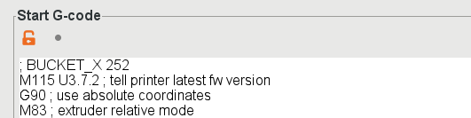
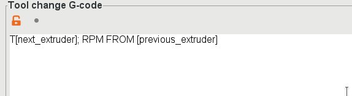
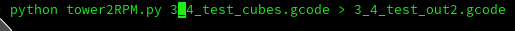

# RPM-Post
Postprocessing scripts for BigBrain3D RPM

This is very much a WIP early release. Advanced features like wipe-to-infill and wipe objects are currently not supported.
I have written it with the intent of fully respecting all PrusaSlicer settings for toolchanges, e.g. ramming, purge volumes, cooling moves, etc.

Initial script work is based on the work Gnat and I collaborated on in the Prusa Forums and Gitlab:
https://gitlab.com/gnat.org/originalprusa/tree/master/devices/mmu2
https://forum.prusaprinters.org/forum/original-prusa-i3-mmu2s-mmu2-general-discussion-announcements-and-releases/the-mmu2-purge-bucket-thread-mod-wip/

### NOTE: Consider yourself warned: this script is provided as-is and with no guarantees of any kind, express or implied, and you use it at your own risk. YMMV, I'm not responsible for printer damage, global thermonuclear war, family fallouts, or other side effects and coincidences that may arise from using this script.

To use:
- Tell the code where your bucket is located by adding `; BUCKET_X <x value>` to your printer startup gcode

- Disable the wipe tower. (You must temporarily re-enable it to restore purge volumes button.)
- Set the following as your custom toolchange g-code: 
      `T[next_extruder]; RPM FROM [previous_extruder]`

- If you need to change motor currents to prevent stalling/skipping on the bucket mechanism, simply prefix and postfix the T command above with your `M907` motor current values. 
- If your purge mechanism activates at X 250 or below, you will need to adjust the size of the default prime line. It goes to X=240. The postprocessing script will fail if it detects gcode that tries to print in a "danger zone" near the mechanism activation, i.e. your BUCKET_X - 10mm. If run via console, it will print out the first offending line of gcode that exceeded the bounds. 
- Run the script. You can set this as a processing script in PrusaSlicer, but I suggest using the console first for easier debugging. Outfile is optional, if not provided it will overwrite the input file (which is what PrusaSlicer expects.)
    python tower2RPM.py [myfile.gcode] [outfile.gcode]

  
  
